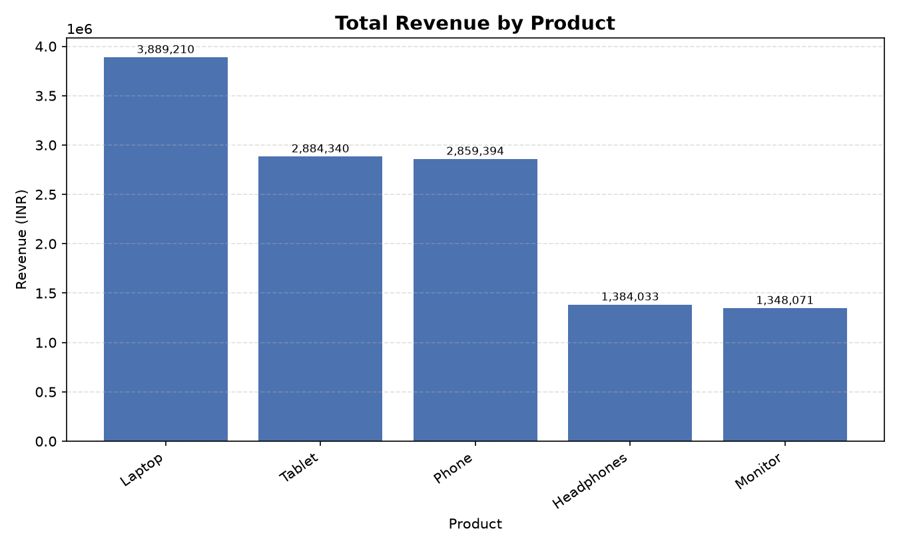
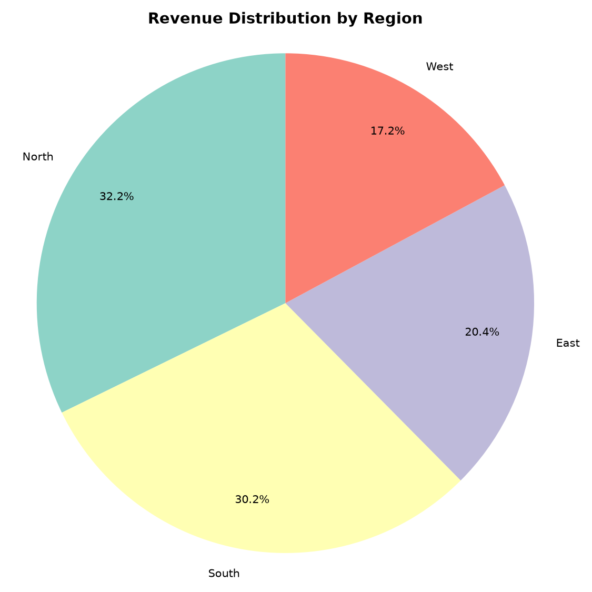
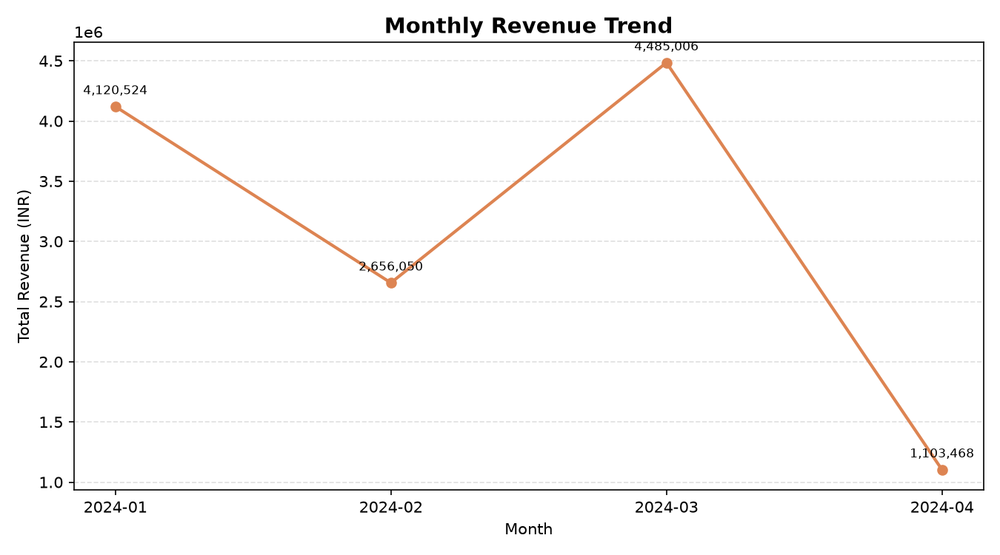

# E-commerce Sales Analysis Report

## Overview
This report summarizes e-commerce sales performance based on transaction-level order data, covering data loading, cleaning, analysis, and visualization.

## Key Metrics
- **Total revenue analyzed:** ₹12,365,048
- **Total units sold:** 478
- **Number of orders:** 100
- **Average order value:** ₹123,650
- **Unique customers:** 100
- **Revenue per customer:** ₹123,650
- **Top product by revenue:** Laptop (₹3,889,210, 31.5% of total)
- **Top region by revenue:** North (₹3,983,635, 32.2% of total)
- **Best-selling product by units:** Laptop

## Revenue by Product

| Product | Revenue (INR) | % of Total |
|---|---|---|
| Laptop | 3,889,210 | 31.5% |
| Tablet | 2,884,340 | 23.3% |
| Phone | 2,859,394 | 23.1% |
| Headphones | 1,384,033 | 11.2% |
| Monitor | 1,348,071 | 10.9% |

## Revenue by Region

| Region | Revenue (INR) | % of Total |
|---|---|---|
| North | 3,983,635 | 32.2% |
| South | 3,737,852 | 30.2% |
| East | 2,519,639 | 20.4% |
| West | 2,123,922 | 17.2% |

## Monthly Trend

| Month | Total Revenue (INR) |
|---|---|
| 2024-01 | 4,120,524 |
| 2024-02 | 2,656,050 |
| 2024-03 | 4,485,006 |
| 2024-04 | 1,103,468 |

## Visualizations

## Insights

1. **Laptop drives the most revenue**, contributing 31.5% of total sales. Combined with it being also the best-selling product by units (Laptop sells the most units), this shows whether revenue leadership comes from price or from volume.
2. **North is the strongest region**, generating 32.2% of total revenue. Regions significantly below this level may be under-served or under-marketed.
3. Revenue changed by **-75.4%** from the previous month to the latest month.
4. Average order value is ₹123,650 across 100 orders from 100 unique customers (₹123,650 revenue per customer on average).

## Data Quality Notes
The raw dataset contained missing values (Product/Region), invalid or negative Quantity/Price, unrecognized region names, inconsistent casing, rows where `Total_Sales` didn't match `Quantity * Price`, and duplicate rows. All of these were detected and handled during the cleaning step (missing/invalid rows dropped, mismatched totals recalculated) — see console output / `data/sales_clean.csv` for the cleaned dataset, and `main.py::clean_data()` for the exact rules applied.